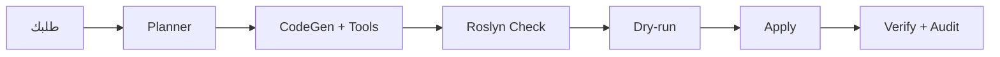

  <picture>
    <source media="(prefers-color-scheme: dark)" srcset="assets/revitai-logo-horizontal-black.svg">
    
  </picture>

# RevitAI

مساعد ذكاء اصطناعي لـ Revit يحوّل اللغة الطبيعية إلى عمل حقيقي داخل النموذج، مبني فوق BIBIM مفتوح المصدر.

Apache 2.0BYOKبدون تليمتريRevit 2022 – 2027C# + WebView2

## *01* ما هو BIBIM؟

BIBIM إضافة (Add-in) لبرنامج Revit من شركة SquareZero Inc. تكتب ما تريده بلغتك، فيخطط المهمة، ويسألك فقط عمّا ينقصه فعلاً، ثم يولّد كود C# ويفحصه ويجرّبه تجريبياً، ولا يطبّقه على النموذج إلا عندما تضغط **Apply**.

**BYOK = أحضر مفتاحك بنفسك.** يتصل مباشرة بمزوّد النموذج الذي تختاره بمفتاحك أنت. لا حسابات، لا اشتراكات، ولا تليمتري.

## *02* مفتوح المصدر: ماذا يعني لنا؟

الكود منشور على GitHub (`SquareZero-Inc/bibim-revit`) بترخيص **Apache 2.0**.

- يحق لنا الاستخدام والتعديل والتوزيع، حتى تجارياً.
- يجب الإبقاء على ملف `LICENSE` وإشعارات حقوق النشر في رأس الملفات، وتوضيح ما غيّرناه.
- الترخيص لا يمنحنا حق استخدام اسم BIBIM وعلامته، فمنتجنا يظهر باسمه الخاص (RevitAI).
- في التقرير والعرض نفصل بوضوح: **الأساس** (BIBIM) و**إضافتنا**.

## *03* كيف يعمل؟

**1) Planner**

يصنّف المهمة (قراءة أو كتابة، ونوعها: استعلام، تصدير، تعديل، إنشاء...) ويسأل الأسئلة الناقصة فقط. ويرفض فوراً ما يستحيل داخل جلسة تعمل، كأزرار الـ ribbon.

**2) CodeGen + Tools**

النموذج يستخدم أدوات: بحث محلي في `RevitAPI.xml`، سياق النموذج (التحديد، المستويات، الـ parameters)، وعدّ وسرد العناصر، وبحث في مكتبة الأكواد.

**3) Roslyn Check**

يترجم الكود ويشغّل 5 محللات (BIBIM001–005) مع إصلاح تلقائي، قبل أن يصل لك أي شيء.

**4) Dry-run**

ينفّذ الكود ثم يتراجع، ويخبرك كم عنصراً سيتغيّر. وإن فشل أو أعطى صفراً يصحّح نفسه مرة واحدة.

**5) Apply + Verify**

تطبيق فعلي، ثم قياس التغيير الحقيقي (مضاف/معدّل/محذوف)، وسطر في سجل تدقيق محلي، ومعه Undo.

قاعدة Revit: لا يُسمح بنداء الـ API إلا من الـ thread الرئيسي، لذلك كل تنفيذ يمر عبر `ExternalEvent`.

## *04* ما يقدمه اليوم (الإصدار 1.2.0)

**أسئلة سريعة بلا كود**

"كم باباً في الدور الثاني؟" تُجاب من أدوات القراءة خلال ثوانٍ.

**تعديل آمن**

معاينة قبل التطبيق، وتحقق بعده، وUndo بضغطة.

**إرفاق مستند**

ملف md/txt/csv فيه جدول ElementId، فيُصلح العناصر المخالفة المذكورة فقط.

**مكتبة الأكواد**

يحفظ الأكواد الناجحة ويبحث فيها ليعدّلها لمهام مشابهة.

**نماذج متعددة**

Claude (Sonnet 5 وOpus 5.5 وOpus 5 وFable 5.1)، وGPT-6 وGPT-5.6، وأي خادم محلي متوافق مع OpenAI.

**أمان وشفافية**

مفاتيح مشفّرة بـ DPAPI، وسجل تدقيق في `%APPDATA%\BIBIM\audit`، ومؤشر تقدّم حي.

## *05* البنية التقنية

| الطبقة | الملفات | الدور |
| --- | --- | --- |
| الواجهة | `frontend/` (React) | اللوحة داخل WebView2 |
| الجسر | `WebView2Bridge.cs` | رسائل JS ⇄ C# |
| التحكم | `BibimDockablePanelProvider*.cs` | Planner، تدفق المهام، تشغيل التوليد |
| الأدوات | `BibimToolService.cs`، `RevitContextProvider.Query.cs` | تعريف الأدوات وتنفيذها |
| النماذج | `Services/Providers/`، `ModelCatalog.cs` | Anthropic / OpenAI / Local |
| التنفيذ | `BibimExecutionHandler.cs` | Dry-run / Commit / Undo |
| الأمان | `ConfigService.cs`، `SecretProtector.cs` | الإعدادات والمفاتيح |

## *06* ما سنبنيه فوقه

**list_types قيد الاختبار**

أداة تعرض أنواع أي فئة (الجدران والأرضيات وغيرها) مع Id وعدد الاستخدام والأبعاد. مكتوبة، وتنتظر التجربة داخل Revit.

**معايير الشركة مخطط**

ملف قواعد (تسمية، أنواع معتمدة، مقاسات) يُحقن في التعليمات، فيعمل النموذج بمعاييرك أنت.

**فحص القواعد + إصلاح بضغطة مخطط · القلب**

أداة `check_rules` تُخرج جدول مخالفات (ElementId)، ويمرّ الإصلاح بمسار المعاينة والتطبيق الموجود.

**تحليل أثر التعديل مخطط**

عرض العناصر المتأثرة (الأبواب على الجدار، الغرف، الوسوم) قبل Apply.

**تقارير وكميات مخطط**

تصدير الكميات والنتائج إلى Excel بصيغة جاهزة.

**تسجيل نتائج الأدوات تحسين**

اللوج يسجل نداء الأداة دون ناتجها، مما يصعّب التحقق. نضيف ناتجاً مختصراً.

### حزمة العربية: ميزتنا المميزة

BIBIM يعمل اليوم بالإنجليزية والكورية. هذه الحزمة تجعله يفهم العربية فعلاً، من الفصحى إلى العامية، وهي ما يميّز مشروعنا عن الأصل.

**قاموس مصطلحات BIM عربي أولوية 1**

يربط «باب، جدار، دور، غرفة، عمود» بأسماء الفئات الإنجليزية (بجانب الخريطة الحالية في `TryResolveCategoryId`) ويُحقن في الـ Planner، فيُفهم «كم باباً في الدور الأول؟» بدقة.

**شبكة أمان بالأفعال العربية أولوية 1**

إضافة أفعال مثل احذف وامسح وعدّل وغيّر وانقل وانسخ وأنشئ وضع وسمّي إلى `ContainsWriteIntent`، حتى لا يتحول طلب تعديل إلى دردشة عادية إذا فشل الـ Planner.

**تطبيع النص العربي أولوية 1**

توحيد الألف والياء والتاء المربوطة، وحذف التشكيل، وتحويل الأرقام ٠–٩ إلى 0–9 قبل المطابقة. فيطابق «الدور الأول» اسم Level مكتوباً بصيغة أخرى، ويفيد بحث مكتبة الأكواد (المبني حالياً على الكورية).

**العربية كلغة ثالثة أولوية 2**

تُضاف بجانب EN وKR (تُحدَّد وقت الـ build حالياً): تعليمات الـ Planner، ونصوص الواجهة، ورسائل الأخطاء، وتعليقات الكود المولّد.

**واجهة RTL أولوية 2**

اتجاه اللوحة وفقاعات المحادثة والجداول، مع إبقاء كتل الكود LTR.

**تقارير عربية أولوية 2**

ملفات Excel بأوراق RTL وعناوين عربية، وملخص نتائج الفحص بالعربية.

**حزم قواعد محلية أولوية 3**

حزمة JSON لكل كود أو جهة، فوق فاحص القواعد. القيم تُؤخذ من المصدر الرسمي ويراجعها مهندس، ولا نكتبها من الذاكرة.

**بيانات عربية داخل النموذج أولوية 3**

قراءة وكتابة أسماء الغرف والأنواع والملاحظات بالعربية بسلامة، مع اختبارات ترميز.

**عربي مقابل إنجليزي بحثي**

نفس الطلبات بالفصحى والعامية المصرية والإنجليزية، ونقيس الفرق في نجاح المحاولة الأولى. نتيجة علمية جاهزة للتقرير.

**إدخال صوتي فكرة للتجربة**

لا نعرف إن كان مدعوماً داخل WebView2 بالعربية، فنجرّبه أولاً قبل أن نعد به.

## *07* الوكلاء (Agents)

نبني الوكلاء على نفس حلقة الأدوات الموجودة، وبقاعدة واحدة: **الوكيل يقترح، والكود الحتمي ينفّذ، والإنسان يوافق.**

**Standards Agent**

يقرأ ملف المعايير ويحوّل طلبك إلى قيود.

**QA Agent**

يشغّل القواعد ويرتّب المخالفات حسب الخطورة.

**Fixer Agent**

يقترح كود إصلاح لكل مجموعة، ويمر بـ Roslyn وDry-run.

**Reporter Agent**

يلخّص بالعربية ويصدّر Excel أو PDF.

**Design Agent اتجاه مستقبلي**

يقترح معاملات منظّمة، وكود حتمي يبني العناصر. مسألة بحثية، فنذكرها كـ Future Work.

## *08* خريطة الطريق إلى منتج متكامل

| المرحلة | المحتوى | مخرج قابل للعرض |
| --- | --- | --- |
| 0 · الأساس | تشغيل BIBIM، و`list_types`، ومشروع اختبار ثابت | إجابات مُتحقَّق منها |
| 1 · المعايير | ملف القواعد وحقنه في التعليمات | نفس الطلب، سلوك مختلف حسب الشركة |
| 2 · الفحص والإصلاح | `check_rules` + Fixer | "12 باباً مخالفاً، اضغط للإصلاح" |
| 3 · الأثر والتقارير | Change Impact، وتصدير Excel | معاينة الأثر قبل التعديل |
| 4 · العربية والتجربة | حزمة العربية: القاموس، التطبيع، الأفعال، RTL، التقارير | استخدام كامل بالعربية |
| 5 · القياس والتقرير | 20 حالة اختبار، ومقارنة قبل وبعد | أرقام للتقرير والمناقشة |

## *09* كيف نقيس الجودة؟

- **الحقيقة من Revit أولاً:** نقارن كل إجابة بجدول Schedule حقيقي قبل أن نصدّقها.
- **المقاييس:** نجاح من المحاولة الأولى، الزمن، التوكنز (من اللوج)، وصحة الأرقام.
- **مشروع اختبار ثابت** ومجموعة طلبات ثابتة، قبل كل ميزة وبعدها.
- **اختبار عربي:** نفس الطلبات بالفصحى والعامية والإنجليزية، ونقارن النتائج.

## *10* تنبيهات

- الـ endpoint المجاني في OpenRouter يسجّل الاستخدام، فلا تضع عليه بيانات مشروع حقيقية.
- جرّب دائماً على نموذج تجريبي، وراجع المعاينة قبل Apply.
- ليس لنا ارتباط أو رعاية من Autodesk.

RevitAI مبني على BIBIM (Apache 2.0) — [github.com/SquareZero-Inc/bibim-revit](https://github.com/SquareZero-Inc/bibim-revit). أي نص أو ميزة في هذا الدليل تحت «مخطط» لم تُنفَّذ بعد.