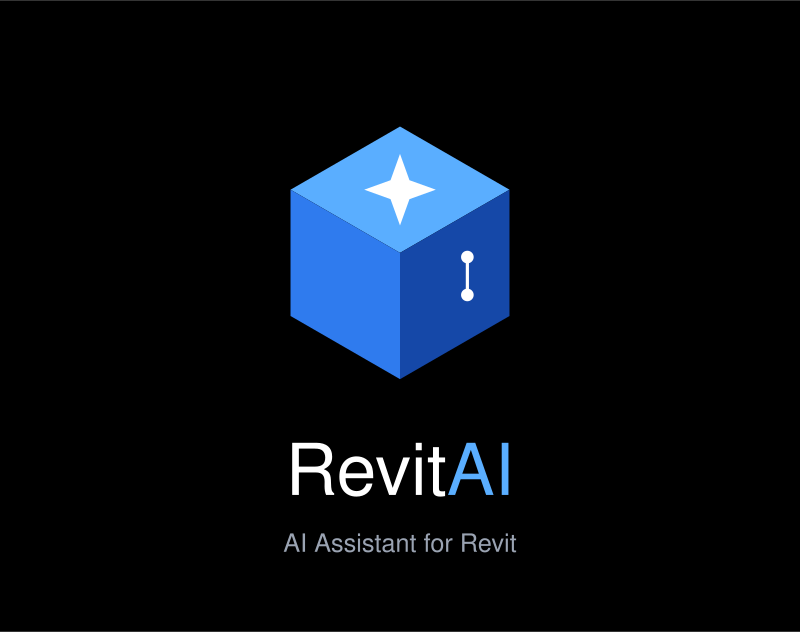

<p align="center">
  
</p>

# AI Agent for Revit

## Overview

Built an Agentic AI assistant for Autodesk Revit that automates BIM workflows using natural language, AI Agents, and the Revit API to save engineers time on routine tasks, reduces errors, and makes it easy to extract information from the model — without requiring engineers to learn complex tools or dig through the model manually.

## Core Problem

BIM engineers lose a significant portion of their working time on repetitive, low-value technical tasks: manually placing tags one by one, building schedules by hand, hunting for clashes and standards violations across a large model, and digging through schedules or the 3D view just to answer a simple question about quantities or areas. This constant context-switching between "doing engineering" and "doing data entry" pulls focus away from actual design decisions, slows down project delivery, and increases the chance of human error — especially on large models where nothing can realistically be checked element by element.

## Goal

Build a single, natural-language interface inside Revit that acts as a copilot for the BIM engineer throughout their daily workflow. Instead of learning multiple disconnected tools, macros, or menu paths, the engineer should be able to simply describe what they want — ask a question, request a repetitive task, or ask for a model to be checked — and have the assistant either answer directly from the model's data or execute the action safely, with the engineer always in control of anything that modifies the model. The long-term ambition is for the same assistant to eventually support early-stage design exploration, not just maintenance of an existing model.

## Solution

A phased, incremental product: start with a solid data layer that can read the model reliably, then layer natural-language querying on top of it, then controlled write-access for automating repetitive tasks, then automated checking for errors and standards violations, and finally — once the foundation is proven — generative assistance for early conceptual design. Each phase is a usable product on its own and reuses the work of the phase before it, so the project never depends on finishing everything before delivering value.

## Requirements

- Autodesk Revit installed locally (a reasonably recent version)
- pyRevit installed and working inside Revit
- Basic Python familiarity (no need for deep expertise)
- Access to an AI model with function-calling / tool-use support
- A way to store/query extracted model data locally (a simple local database is enough to start — no need for anything heavier)
- A test Revit model to experiment on safely (not a live production model)

---

## Roadmap

The project is built in five incremental phases, each building on the previous one's foundation.

### Phase 1 — Foundation (Data Layer)

Build the layer that reads model data: elements, categories, parameters, basic geometry (location, dimensions), and relationships between elements (e.g. which wall a door belongs to). Nothing else works without this.

**Technical approach:** pyRevit (Python). It's faster to prototype with, integrates naturally with AI tooling, and is well suited for the exploration-first stage this project is currently in.

**Architecture:**

```
Revit Model
    -> (pyRevit script reads elements)
Data Extraction Layer (Python)
    -> (converts data into structured format, e.g. JSON)
Structured Data
    -> (ready to be sent to an AI model in Phase 2)
```

No AI is involved in this phase — the priority is proving that clean, structured data can be reliably extracted from the model.

**First milestone:** A pyRevit script that lists all Doors in the model along with their area and location, printed as JSON.

---

### Phase 2 — Data Extraction & Reporting

**Idea:** The user asks a natural-language question about the model, and the tool answers using the data extracted in Phase 1.

**Example questions:**
- "How many doors are on the second floor?"
- "What's the total area of rooms on the ground floor?"
- "Show me all elements made of concrete"
- "Compare finish area between the first and second floors"

**Pipeline:**

```
User question (natural language)
    -> AI model interprets intent via Function Calling
       (e.g. calls count_elements(category="Doors", level=2))
    -> Query executed against data extracted in Phase 1
    -> Result sent back to the AI to phrase as a natural answer
    -> Answer shown to the user (text or table)
```

**Technical approach:** Function Calling / Tool Use — the model is given a set of available tools (e.g. `count_elements`, `sum_parameter`) and decides which to call with which parameters. Clean and reliable, and sufficient for the range of questions in this use case.

**On model size:** Large models can have thousands of elements — sending all of that to the AI on every question is slow and expensive. Since Revit data is structured (not free text), a full vector-search RAG setup is unnecessary; it's simpler and cheaper to let the AI translate the question into a simple filter (category + level, etc.) and run that filter against a local database.

---

### Phase 3 — Repetitive Task Automation

**Idea:** The tool now *writes to* the model, not just reads from it — placing tags, building schedules, organizing sheets, etc.

**Example tasks:**
- "Place tags on all doors on the ground floor"
- "Create a schedule of all windows with their area"
- "Sort sheets by floor order"

**Pipeline:**

```
User command (natural language)
    -> AI converts it into an execution plan (Function Calling)
    -> Confirmation / preview step
    -> Execution via Revit API (inside a transaction)
    -> Post-execution report
```

**Key concept:** Any modification happens inside a Revit **Transaction**, so it can be rolled back if something goes wrong.

**Core principle — Human-in-the-loop:** The AI never executes a model change without the user confirming a preview first. Start with easily reversible, low-risk tasks (e.g. tagging) before riskier ones (e.g. bulk deletions or material changes).

---

### Phase 4 — Error & Clash Detection (QA/QC)

**Idea:** Combining the data layer and write capability, the tool detects problems on its own and can suggest or apply fixes.

**Two types of problems:**
1. **Clashes** — physical intersections between elements
2. **Standards violations** — e.g. insufficient door clearance, insufficient window area for natural lighting

**Pipeline:**

```
Model data
    -> Detection Engine (rules-based checks + AI-assisted checks for ambiguous cases)
    -> List of detected issues (type, location, severity)
    -> Shown to user, with a link to the element in the 3D view
    -> (optional) Suggested or auto-applied fix, with confirmation
```

Most checks are clear geometric/numeric logic and don't need AI to decide from scratch. The best use of AI here is explaining results in natural language and handling ambiguous cases fixed rules don't cover well. Revit already has built-in clash detection (often via Navisworks) — build on top of it rather than reinventing it.

---

### Phase 5 — Design Assistance (Conceptual Design)

**Idea:** Unlike Phases 1–4, this phase generates something new from a description and constraints, rather than working with an existing model.

**Example tasks:**
- "Suggest a layout for a 200 sqm open-plan office for 30 people"
- "Generate 3 layout alternatives for a 120 sqm apartment with 3 bedrooms"

**Pipeline:**

```
User description + constraints
    -> AI generates a proposal (structured parameters, not raw geometry)
    -> Deterministic code converts the proposal into actual Revit elements
    -> Alternatives shown as editable options
```

Letting the AI propose structured parameters while deterministic code builds the geometry avoids hallucinated or geometrically invalid results. This is a research-level problem — even large companies are still actively working on it — so reaching this phase with a solid foundation is already a significant achievement.

---

## Getting Started: Installing pyRevit

1. **Check prerequisites** — Revit installed, basic Python familiarity.
2. **Download pyRevit** from the official GitHub repository (`pyrevitlabs/pyRevit`), Releases section.
3. **Run the installer** — adds a "pyRevit" tab to Revit's ribbon.
4. **Open Revit and verify** the tab appears, with built-in tools to test.
5. **Enable a development environment** — via pyRevit CLI or "pyRevit > Developer Tools" in the ribbon.
6. **Write a first test script (Hello World)** — from the Python Shell (IronPython Console), fetch and print a simple count of elements.
7. **Set up an external IDE** (e.g. VS Code) for writing larger, organized `.py` scripts.
